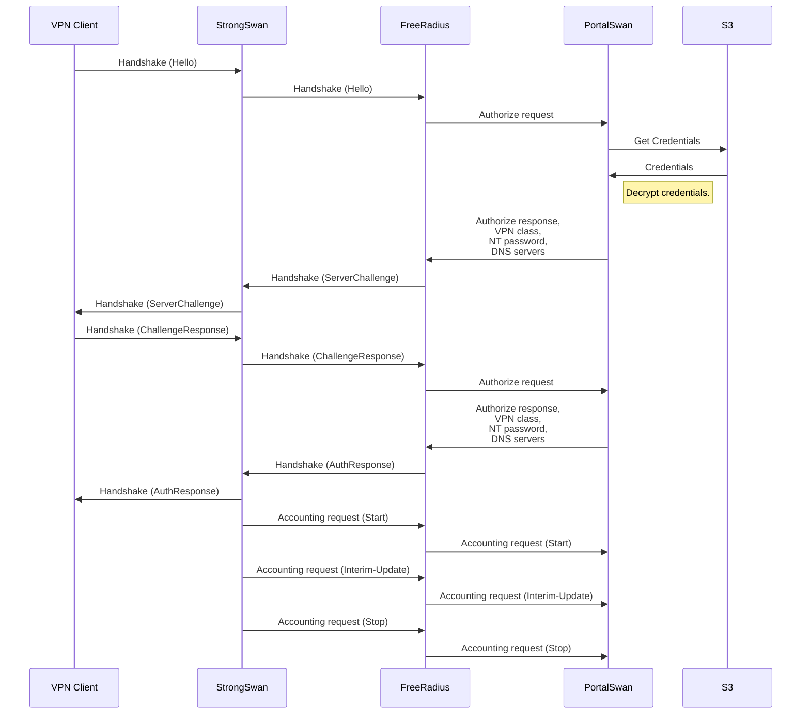

# PortalSwan
Web portal for StrongSwan

## What is it?
PortalSwan is a service written in Go that simplifies the hosting and management of StrongSwan-based VPN servers. It is designed to run in cloud environments, currently supporting AWS out of the box. While Azure and GCP are not supported by default, extending support to other platforms or on-premises infrastructure requires minimal effort.

## How does it work?
PortalSwan expects several components to run alongside
- certbot (tested with 3.1.0)  
  Handles TLS certificate acquisition and renewal. Both PortalSwan and StrongSwan require a valid certificate. Certbot’s post-hook is only necessary for StrongSwan—PortalSwan reloads certificates periodically.
- FreeRADIUS with REST plugin (tested with 3.0.21)  
  Handles MSCHAPv2 authentication and delegates authorization/accounting to PortalSwan via HTTP/JSON.
- StrongSwan (tested with 5.9.10)  
  Implements IKEv2 VPN with EAP/MSCHAPv2 authentication, delegated to FreeRADIUS.
- dnsmasq (tested with 2.85)  
  Optional. Some clients fail to utilize DNS server behind NAT

PortalSwan runs multiple internal services:
- Public HTTP server  
  Redirects users to public HTTPS server. It does not support serving static content which is required to run certbot HTTP-01 validation and that may seem like a flaw. However, since private hostname requires certificate one would use DNS-01 verification instead of HTTP-01 anyway.
- Public HTTPS server  
  - Home page which shows connectivity status by trying to connect to HTTPS server via private hostname.
  - Self service page which allows creating a password.
  - Verification endpoint for connectivity status
- Private HTTP server  
  Provides authorize and accounting endpoint for FreeRADIUS REST plugin.
- VICI client  
  Log events from StrongSwan
- NetFilter client  
  Monitors NATed network connections and associates them with user identity

## Security
- Passwords are set per IP address. When client connects from a new IP address they need to create a new password.
- Passwords are automatically deleted if not used for 15 days.
- Passwords are enrypted. This may look suspicious. Why encrypt passwords instead of HMAC'ing them? MSCHAPv2 protocol requires MD4 unsalted hash of a password. MD4 hash itself is weak, especially unsalted one. HMAC with a strong hash function cannot be used with MSCHAPv2, passwords are hashed with weak MD4 hash and additionally encrypted. While MSCHAPv2 is weak and should not be used in general, each password is valid for a specific IP address only, thus password are actually passcodes and do not need to be very strong.
- Windows 11 22H2 and later disables MSCHAPv2. It can be reenabled by disabling Credential Guard https://learn.microsoft.com/en-us/windows/security/identity-protection/credential-guard/configure?tabs=intune#disable-credential-guard

## Settings
Settings are saved in several places and merged, so one does not have to specify all settings in one place
- `/etc/portalswan/portalswan.conf` file
- AWS secret with name equal to EC2 instance ID of a server running PortalSwan  
  In all cases it's a JSON content

        {
            "identity": {
                "aws": {
                    "identity_store_id": "d-1234567890",
                    "identity_store_region": "eu-central-1",
                    "radius_class_from_group_name_pattern": "([a-z0-9]+)\\.vpn\\.class"
                }
            },
            "credentials": {
                "aws": {
                    "fernet_keys": "HV/I71oQ8o6odu8Z9BQOYQYXcIw8RU5169OVUJuxhOY=",
                    "s3_bucket_name": "vpn-credentials",
                    "s3_bucket_region": "eu-central-1"
                }
            },
            "email": {
                "aws": {
                    "ses_source": "vpn.robot@mail.example.com",
                    "ses_region": "eu-central-1"
                }
            },
            "logging": {
                "aws": {
                    "cloudwatch_log_group": "/vpn",
                    "cloudwatch_log_region": "eu-central-1"
                }
            },
            "client": {
                "destination_prefixes": [
                    "192.168.0.0/16"
                ],
                "dns_servers": [
                    "192.168.5.5"
                ],
                "dns_suffix": "example.local"
            },
            "server": {
                "tls_certificate_path": "/etc/letsencrypt/live/vpn/cert.pem",
                "tls_private_key_path": "/etc/letsencrypt/live/vpn/privkey.pem"
                "verification_hostname": "vpn.example.local"
            }
        }

- identity
    - aws
        - identity_store_id  
          ID of an identity store of IAM Identity Center. Since one will use IAM Identity Center to manage user accounts anyway, it makes sence to avoid building a separate user database. So usernames are email addresses.
        - identity_store_region  
          AWS region of identity store and IAM Identity Center. VPN servers`s EC2 may run in a different region.
        - radius_class_from_group_name_pattern  
          A regular expression pattern (Go syntax) which converts a group name to VPN class. VPN classes may be used to assign IP addresses from different pools to different users based on group membership, thus providing a foundation for network permission management.
- credentials
    - aws
        - s3_bucket_name  
          Name of an S3 bucket where credentials are stored.
        - s3_bucket_region  
          AWS region of S3 bucket. VPN servers`s EC2 may run in a different region.
        - fernet_keys  
          Keys used to encrypt passwords.
- email
    - aws
        - ses_source  
          Email address of sender of emails
        - ses_region  
          AWS region of Simple Email Service. VPN servers`s EC2 may run in a different region.
- logging
    - aws
        - cloudwatch_log_group  
          CloudWatch Logs group. PortalSwan will create stream on demand.
        - cloudwatch_log_region  
          AWS region of CloudWatch Logs. VPN servers`s EC2 may run in a different region.
- client
    - destination_prefixes  
      List of networks behind VPN. Windows built-in VPN client ignores list of prefixes sent from server, prefixes should be configured on client side. PowerShell script addresses this issue.
    - dns_servers  
      List of DNS servers. Only the first two will be actually used. May be just one server.
    - dns_suffix  
      DNS suffix of names behind VPN
- server
    - tls_certificate_path  
      Path to TLS certificate generated by certbot.
    - tls_private_key_path  
      Path to private key of TLS certificate generated by certbot.
    - verification_hostname  
      Hostname of private IP address of VPN server, used to verify connection status. If not specified server hostname will be used.

## Authentication Flow

